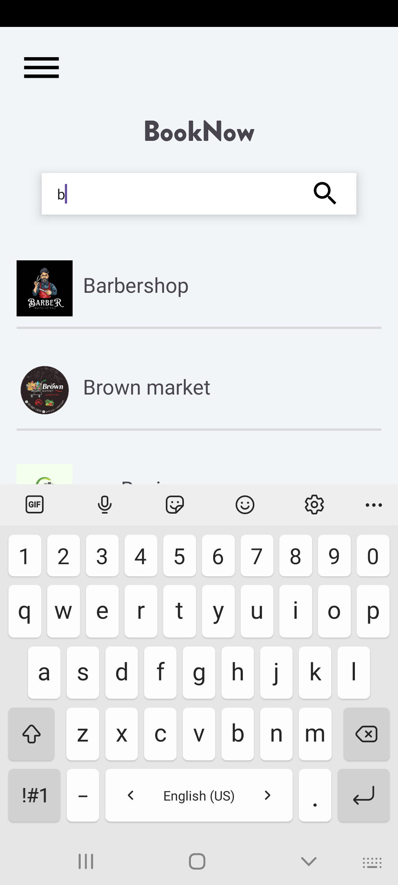
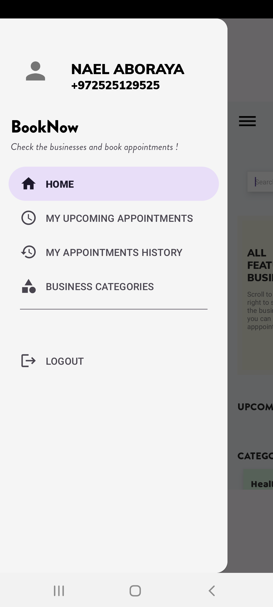
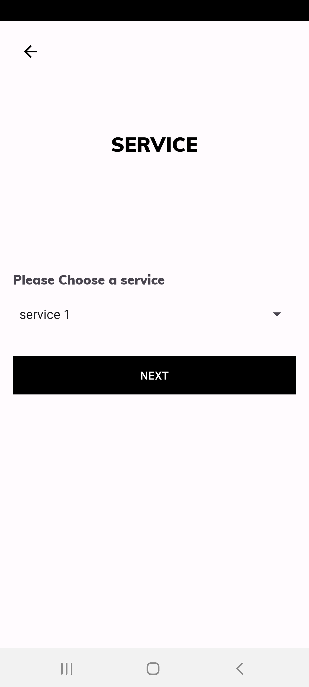
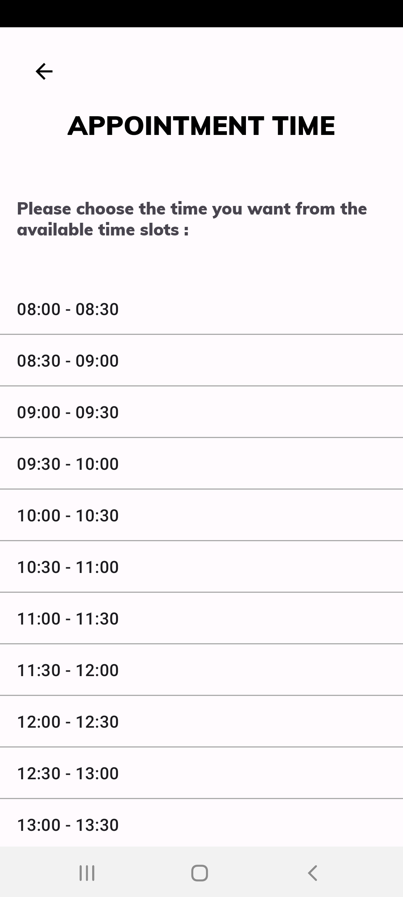
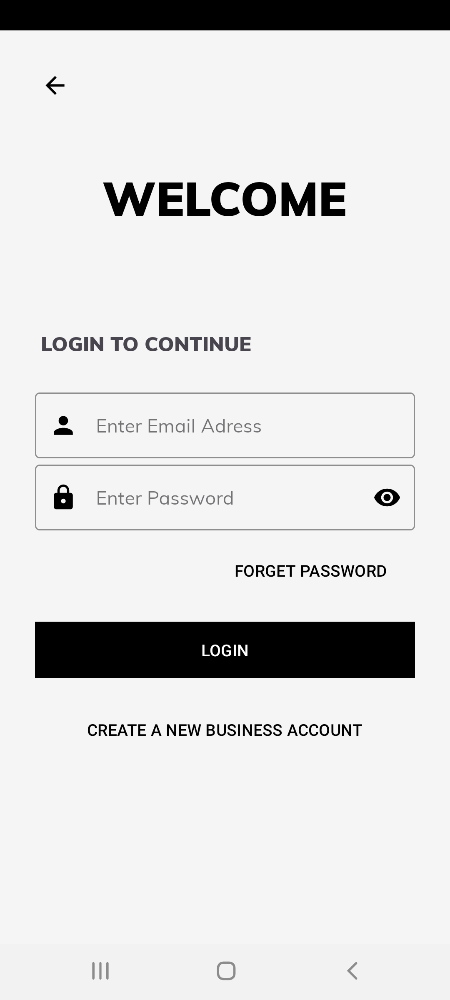
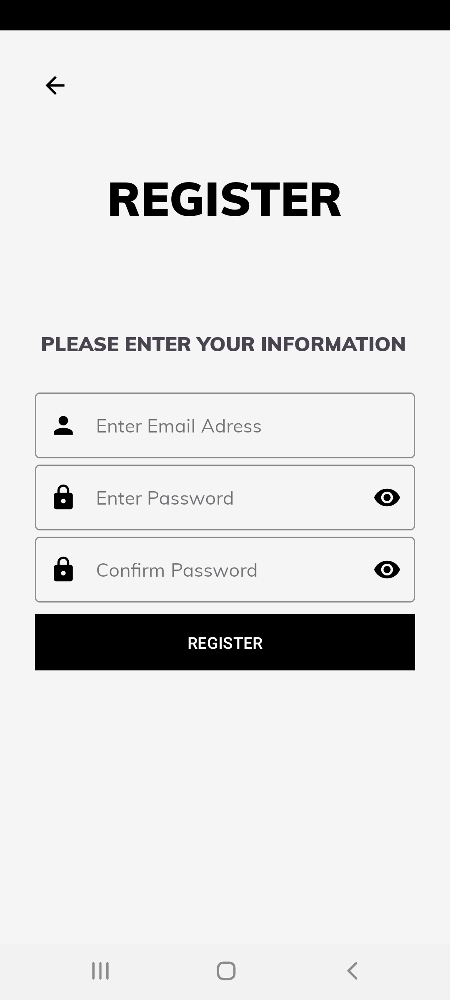
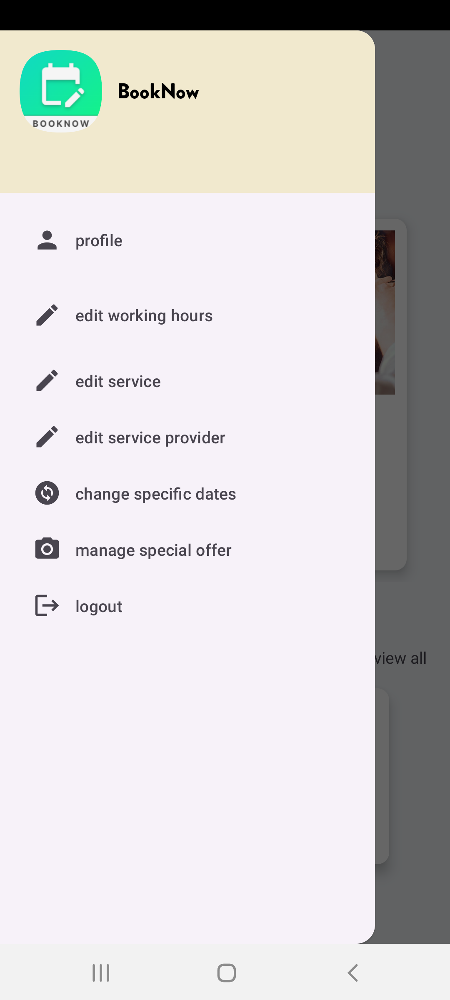
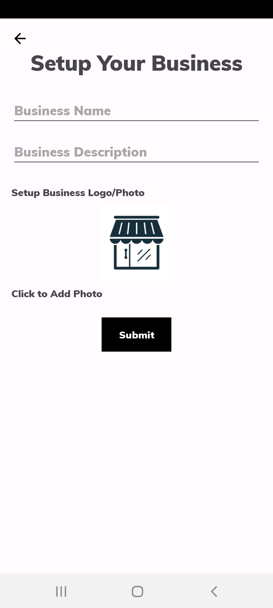
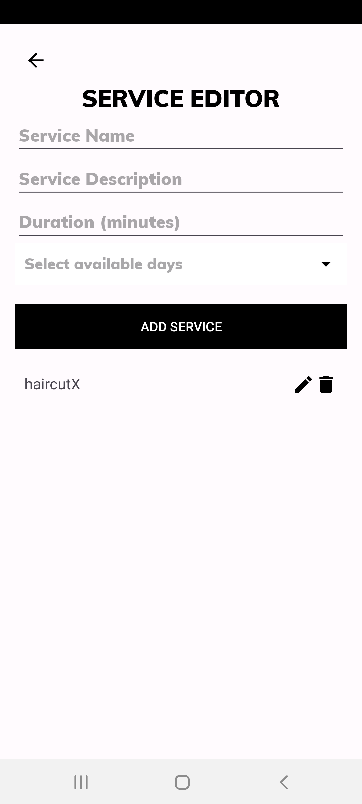

    

# BookNow

BookNow is an Android application designed to facilitate booking and managing appointments for both businesses and customers. It provides customers with a platform to discover featured businesses, browse services, view available time slots, and book appointments hassle-free. On the other hand, it empowers businesses to showcase their services, manage their schedules, and efficiently handle customer appointments.

## Goals

- **Customer Convenience**: Offer customers a seamless booking experience, allowing them to find and book appointments with ease.
- **Business Management**: Provide businesses with tools to efficiently manage their services, schedules, and appointments.
- **Streamlined Communication**: Foster better communication between businesses and customers, enhancing the overall booking process.

## Features

- **Customer Dashboard**: A user-friendly interface for customers to explore businesses, view services, and book appointments.
- **Business Dashboard**: A comprehensive management system for businesses to add services, manage schedules, and handle appointments.
- **Featured Businesses**: Showcase a curated list of businesses, making it easier for customers to discover new services.
- **Category Filters**: Allow customers to filter businesses by categories, helping them find services that suit their needs.
- **Working Hours**: Enable businesses to set regular working hours and special hours for specific dates.
- **Firebase Integration**: Utilize Firebase services for authentication, database management, and storage.

## Screenshots

### Customer UI

    
    
    
    
    
    
    
    
    
    
    

### Business UI

    
    
    
    
    
    
    
    

## Architecture

BookNow is developed using the Model-View-ViewModel (MVVM) architectural pattern, facilitating separation of concerns and promoting code maintainability. It leverages Object-Oriented Programming (OOP) principles to ensure a robust and scalable codebase.

## Security

BookNow employs Firebase Authentication to securely authenticate and verify users, utilizing OTP and email confirmation methods. Firestore is used as the database backend, ensuring data integrity and reliability. Additionally, Firebase Storage is utilized for storing business logos and other media assets securely.

## Software Engineering Patterns

- **Singleton Pattern**: Utilized for managing database instances and other global resources.
- **Observer Pattern**: Implemented to handle data updates and notify UI components of changes.
- **Factory Pattern**: Employed for creating business objects and service instances dynamically.

## Development Stack

- **Android Studio**: IDE for Android application development.
- **Java**: Core language used for implementing the application's business logic.
- **XML**: Markup language used for designing the user interface (UI).

## Development Diagrams and Additional Resources

- [Initiative Document](development_documents/Initiative_document.pdf)
- [Document of Requirements](development_documents/Document_of_requirements.pdf)
- [UML Diagrams](development_documents/UML_diagrams.pdf)

## Contributors

- [Nael Aboraya](https://github.com/naelaboraya)
- [Yousef Masarwa](https://github.com/yousefmasarwa)
- [Mohammed Khateb](https://github.com/khatebMo)
- [Ibrahem Hurani](https://github.com/IbrahemHurani)
